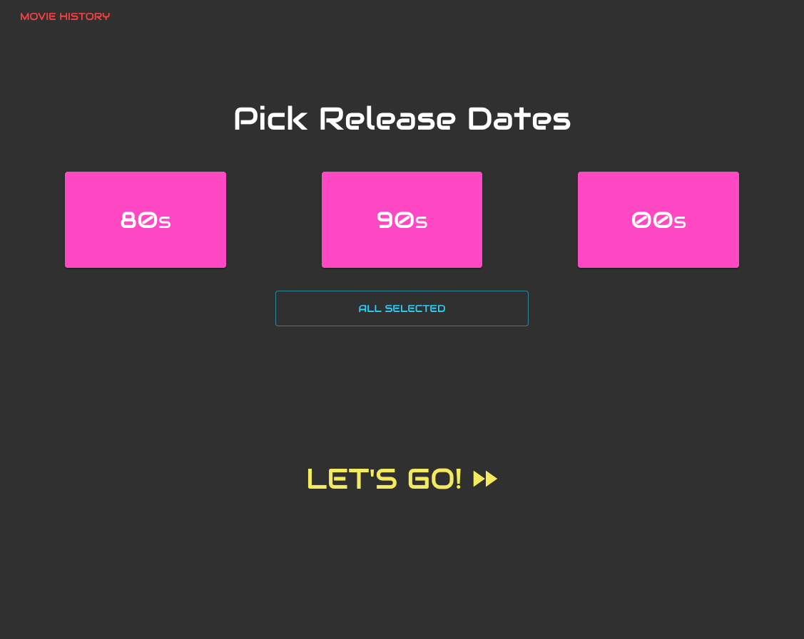
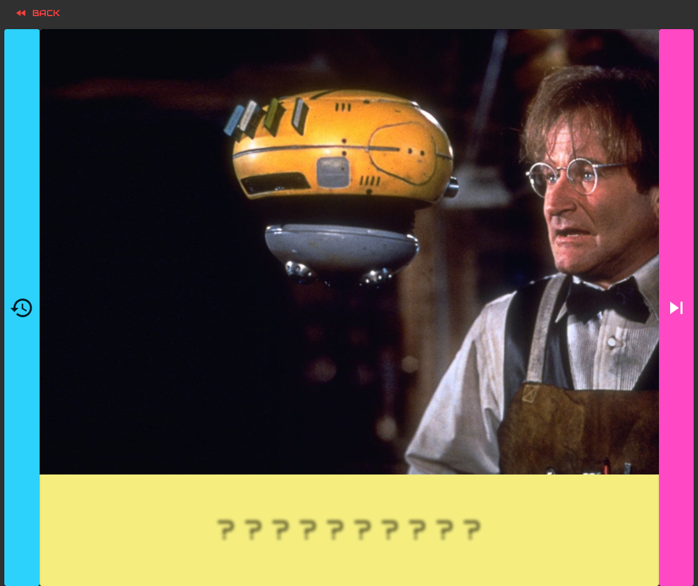
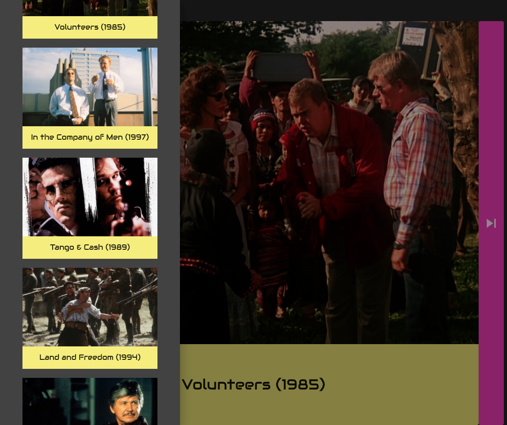

# Zoom Movies

A movie image guessing game for fun on Zoom calls.

## Table of contents

- [About](#about)
- [Installation](#installation)
- [How to use](#how-to-use)
- [Credits](#credits)
- [License](#license)

## About

Thinking of things to do during friendly zoom calls, we started adding movie images to our backgrounds and having others guess. This app is an alternative to finding a movie image, saving it to Desktop, then adding it to virtual background on zoom calls - then doing it all over again for the next movie.

Zoom Movies uses The Movie Database's Discover API to randomly pick movies and display them onscreen. Users can than guess the movie title before revealing.

This project was bootstrapped with [Create React App](https://github.com/facebook/create-react-app).

**Zoom Movies** is live on [Netlify](https://netlify.com/):

[https://zoom-movies.netlify.app](https://zoom-movies.netlify.app)

## Installation

You’ll need to have Node >= 8.10 and npm >= 5.6 on your machine.

```bash
# Clone this repository
$ git clone https://github.com/benjaminsinaiko/zoom-movies.git

# Go into the repository
$ cd zoom-movies

# Install dependencies
$ npm install

# Run the app
$ npm start

# If a new page doesn't open go to http://localhost:3000/ to see your app.

** You will also need a TMDb API key (added to an .env file)

```

## How To Use

Your choice of 80's, 90's, or 00's for movie release dates. Or pick all three.



Hit "Let's Go!" and see a random movie image. Take a guess. Click on the "????" to display the movie title.



Click on the History Icon to see a list of all prior movies displayed.



## Credits

Zoom Movies uses the following open source packages:

- [The Movie Database (TMDb)](https://www.themoviedb.org/documentation/api)
- [React](https://reactjs.org/)
- [React Router v6](https://github.com/ReactTraining/react-router/tree/f59ee5488bc343cf3c957b7e0cc395ef5eb572d2)
- [Axios](https://github.com/axios/axios)
- [Material UI](https://material-ui.com/)

## License

This project is licensed under the terms of the
[MIT license](/LICENSE).

# From Create React App

This project was bootstrapped with [Create React App](https://github.com/facebook/create-react-app).

## Available Scripts

In the project directory, you can run:

### `npm start`

Runs the app in the development mode.<br />
Open [http://localhost:3000](http://localhost:3000) to view it in the browser.

The page will reload if you make edits.<br />
You will also see any lint errors in the console.

### `npm test`

Launches the test runner in the interactive watch mode.<br />
See the section about [running tests](https://facebook.github.io/create-react-app/docs/running-tests) for more information.

### `npm run build`

Builds the app for production to the `build` folder.<br />
It correctly bundles React in production mode and optimizes the build for the best performance.

The build is minified and the filenames include the hashes.<br />
Your app is ready to be deployed!

See the section about [deployment](https://facebook.github.io/create-react-app/docs/deployment) for more information.

### `npm run eject`

**Note: this is a one-way operation. Once you `eject`, you can’t go back!**

If you aren’t satisfied with the build tool and configuration choices, you can `eject` at any time. This command will remove the single build dependency from your project.

Instead, it will copy all the configuration files and the transitive dependencies (webpack, Babel, ESLint, etc) right into your project so you have full control over them. All of the commands except `eject` will still work, but they will point to the copied scripts so you can tweak them. At this point you’re on your own.

You don’t have to ever use `eject`. The curated feature set is suitable for small and middle deployments, and you shouldn’t feel obligated to use this feature. However we understand that this tool wouldn’t be useful if you couldn’t customize it when you are ready for it.

## Learn More

You can learn more in the [Create React App documentation](https://facebook.github.io/create-react-app/docs/getting-started).

To learn React, check out the [React documentation](https://reactjs.org/).

### Code Splitting

This section has moved here: https://facebook.github.io/create-react-app/docs/code-splitting

### Analyzing the Bundle Size

This section has moved here: https://facebook.github.io/create-react-app/docs/analyzing-the-bundle-size

### Making a Progressive Web App

This section has moved here: https://facebook.github.io/create-react-app/docs/making-a-progressive-web-app

### Advanced Configuration

This section has moved here: https://facebook.github.io/create-react-app/docs/advanced-configuration

### Deployment

This section has moved here: https://facebook.github.io/create-react-app/docs/deployment

### `npm run build` fails to minify

This section has moved here: https://facebook.github.io/create-react-app/docs/troubleshooting#npm-run-build-fails-to-minify
